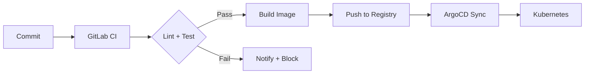

# انتخاب پشته فنی (Technology Stack)
## سامانه کارگزاری ماده ۱۰ — با توجیه

> **اصل راهنما:** امنیت و Reliability بر performance مقدم است. انتخاب‌ها باید الزامات تست نفوذ (OWASP ASVS Level 2)، مقیاس ملی، و الزامات حاکمیتی را پاس کنند.

---

## ۱. نمای کلی

| لایه | انتخاب | دلیل اصلی |
|---|---|---|
| **Backend** | Go (Golang) | Performance + امنیت حافظه + کامپایل static binary |
| **Frontend (Web)** | Next.js (React) | SSR برای SEO/performance + TypeScript type-safety |
| **Mobile** | Flutter | یک کدبیس برای iOS و Android — نقشه‌بردار اپ میدانی |
| **Database** | PostgreSQL 16 + PostGIS | ACID + GIS native + RLS + JSONB + Audit با pgAudit |
| **Cache** | Redis (Sentinel) | Session + OTP + Rate Limiting + Cache استعلام‌ها |
| **Message Broker** | NATS JetStream | سبک، پرسرعت، At-least-once delivery بدون overhead Kafka |
| **Object Storage** | MinIO (S3-compatible) | Self-hosted روی زیرساخت داخلی — حاکمیت داده |
| **Container** | Docker + Kubernetes | مقیاس‌پذیری افقی + rolling deploy + self-healing |
| **API Gateway** | Traefik | Native K8s + Let's Encrypt + Rate Limiting + Circuit Breaker |
| **Monitoring** | Grafana stack (LGTM) | Loki + Grafana + Tempo + Mimir — همه در یک اکوسیستم |
| **CI/CD** | GitLab CI + ArgoCD | GitOps — هر commit روی staging، release tag روی production |
| **Secrets** | HashiCorp Vault | کلیدهای رمزنگاری، API keys سازمان، توکن PSP |

---

## ۲. تحلیل تفصیلی هر انتخاب

### ۲.۱ Backend: Go (Golang)

**چرا Go؟**

| معیار | Go | رقبا |
|---|---|---|
| **امنیت حافظه** | Memory-safe (no buffer overflow) + race detector | Java: safe اما JVM سنگین / Node.js: event loop bottleneck / Python: GIL |
| **Performance** | Compiled, goroutines lightweight (چند هزار connection هم‌زمان) | Rust هم خوبه ولی learning curve بالاتر |
| **Static Binary** | یک فایل اجرایی بدون dependency — deploy فوق‌العاده ساده | ایده‌آل برای محیط‌های restricted دولتی |
| **Concurrency** | goroutine + channel — مدل CSP | مناسب برای پردازش موازی درخواست‌های Integration |
| **Ecosystem** | echo/gin/fiber برای HTTP + GORM/sqlx برای DB | کتابخانه‌های بالغ و مستند |
| **استاندارد TLS** | crypto/tls بومی — بدون وابستگی به OpenSSL | TLS 1.3 پشتیبانی کامل |

**Framework پیشنهادی:** [Echo](https://echo.labstack.com) — سبک، پرسرعت، middleware-rich، JWT built-in.

```
backend/
├── cmd/server/main.go        # entrypoint
├── internal/
│   ├── handler/              # HTTP handlers (thin — فقط validation + routing)
│   ├── service/              # Business logic
│   ├── repository/           # Data access (PostgreSQL)
│   ├── integration/          # Adapterهای سازمان (هر سرویس یک adapter)
│   ├── auth/                 # JWT + OTP + RBAC
│   ├── geo/                  # EXIF validation + PostGIS queries
│   └── config/               # Configuration (env → struct)
├── migrations/               # golang-migrate
└── Dockerfile
```

---

### ۲.۲ Frontend (Web): Next.js 14+ (App Router)

**چرا Next.js؟**

| معیار | Next.js | رقبا |
|---|---|---|
| **SSR** | Server-side rendering — امن‌تر (token validation سمت سرور) | CRA/SPA محض: JWT در client یعنی attack surface بیشتر |
| **TypeScript** | Type-safety end-to-end با API contract | الزامی برای پروژه با پیچیدگی بالا |
| **Server Actions** | ارسال مستقیم به backend بدون expose کردن API داخلی | لایه امنیتی اضافه |
| **Image Optimization** | بهینه‌سازی خودکار تصاویر (عکس‌های ملک) | مهم برای UX موبایل |
| **Middleware** | Edge middleware برای redirect غیرمجازها | auth guard در لبه |

**ساختار:**

```
frontend/
├── app/
│   ├── (auth)/           # login, register
│   ├── (dashboard)/      # applicant dashboard
│   │   ├── cases/        # لیست پرونده‌ها
│   │   └── cases/[id]/   # جزئیات پرونده + گردش‌کار
│   ├── (expert)/         # پنل کارشناسان
│   └── (admin)/          # پنل ادمین
├── components/
│   ├── ui/               # shadcn/ui components
│   ├── map/              # OpenLayers integration
│   └── workflow/         # Stepper + state machine visualization
├── lib/
│   ├── api/              # API client (typed)
│   └── auth/             # JWT management
```

---

### ۲.۳ Mobile: Flutter

**چرا Flutter؟**

| معیار | Flutter | React Native |
|---|---|---|
| **عملکرد گرافیکی** | Skia engine — رندر مستقیم | Bridge به native — latency |
| **GPS/Camera** | پلاگین‌های بالغ برای Geo-tag، عکس، EXIF خواندن | خوب ولی ناپایدارتر در آپدیت‌ها |
| **Offline-first** | Hive/Isar — دیتابیس محلی قوی | AsyncStorage ضعیف‌تر |
| **یک کدبیس** | iOS + Android با یک کد | همینه ولی bridge overhead |

**کاربرد:** فقط برای **کارشناس نقشه‌بردار** (اپ میدانی):
- عکس‌برداری با Geo-tag خودکار
- مشاهده موقعیت ملک روی نقشه
- تکمیل جدول توصیفی در محل
- آپلود آفلاین (ذخیره محلی + همگام‌سازی)

---

### ۲.۴ Database: PostgreSQL 16 + PostGIS

**چرا PostgreSQL؟**

| نیاز پروژه | قابلیت PostgreSQL |
|---|---|
| **ACID تراکنش‌ها** | Transactions با isolation level قابل تنظیم |
| **داده‌های GIS** | PostGIS — ذخیره و کوئری مختصات جغرافیایی، فاصله‌سنجی |
| **JSONB** | descriptive_table، org_response_raw، metadata — schema-flexible |
| **Row-Level Security** | RLS — ایزوله‌سازی داده متقاضی/کارشناس در سطح دیتابیس |
| **Full-Text Search** | tsvector — جستجوی فارسی (با تنظیم dictionary) |
| **Audit** | pgAudit extension — Audit logging در سطح دیتابیس |
| **Encryption** | pgcrypto — pgp_sym_encrypt برای فیلدهای حساس |
| **Maturity** | ۳۰ سال سابقه، مورد تایید سازمان‌های دولتی ایران |

---

### ۲.۵ Message Broker: NATS JetStream

**چرا NATS نه Kafka؟**

| معیار | NATS | Kafka |
|---|---|---|
| **حجم داده** | پیام‌های JSON چند کیلوبایتی (API request/response) | میلیون‌ها event در ثانیه — برای ما overkill |
| **سادگی عملیات** | یک binary واحد، پیکربندی ساده | ZooKeeper + broker + complex tuning |
| **مقیاس‌پذیری** | ۱۰-۵۰ نود — برای مقیاس ملی کافی | هزاران نود — برای Netflix-scale |
| **At-least-once** | JetStream — persistence + replay | Exactly-once با overhead بالا |
| **Footprint** | ~۲۰MB RAM | ~۶GB RAM minimum |

**موارد استفاده:**
- صف ارسال درخواست‌ها به سازمان (با retry)
- Event sourcing برای state machine (تغییر وضعیت پرونده)
- ارسال نوتیفیکیشن‌ها به صورت async

---

### ۲.۶ Object Storage: MinIO

**چرا MinIO نه S3 ابری؟**

- **حاکمیت داده:** اسناد هویتی/مالکیتی نباید روی cloud خارجی ذخیره شوند.
- **S3-compatible:** کد application با AWS S3 SDK کار می‌کند — اگر بعداً سازمان ابر داخلی (ابر دولت) ارائه داد، migration بدون تغییر کد.
- **Performance:** ۲۰۰+ GB/s throughput — برای فایل‌های نقشه (DXF/DWG که ممکن است بزرگ باشند) کافی است.
- **Encryption:** SSE-S3 (Server-Side Encryption) — هر فایل با کلید مستقل رمزنگاری می‌شود.

---

### ۲.۷ Monitoring: LGTM Stack

| جزء | ابزار | کاربرد |
|---|---|---|
| **Logs** | Loki | جمع‌آوری لاگ از تمام سرویس‌ها — جستجوی full-text |
| **Metrics** | Mimir (Prometheus-compatible) | متریک‌های performance، latency، error rate |
| **Traces** | Tempo | Distributed tracing — ردیابی یک درخواست در تمام میکروسرویس‌ها |
| **Dashboards** | Grafana | داشبوردهای عملیاتی + alerting |

**هشدارهای حیاتی:**

- **Organization API قطع است (> ۲ دقیقه)** → پیامک/تلگرام به تیم
- **صف Integration > ۵۰ پیام** → هشدار
- **Error rate > ۱٪** → هشدار
- **DB connection pool > ۸۰٪** → هشدار
- **Disk usage > ۸۵٪** → هشدار

---

### ۲.۸ CI/CD: GitLab CI + ArgoCD



**Pipeline مراحل:**

| مرحله | ابزار | شرح |
|---|---|---|
| Lint | golangci-lint + ESLint | بررسی کیفیت کد |
| Test | go test + Jest + Playwright | Unit + Integration + E2E |
| SAST | Semgrep / SonarQube | تحلیل ایستای امنیتی |
| Dependency Scan | Trivy / Snyk | اسکن آسیب‌پذیری وابستگی‌ها |
| Build | Docker BuildKit | Build بهینه با cache |
| Deploy Staging | ArgoCD | استقرار خودکار روی staging |
| DAST | ZAP Baseline | اسکن پویای امنیتی روی staging |
| Deploy Production | ArgoCD (manual gate) | نیاز به تأیید دستی |

---

## ۳. انتخاب‌های حذف‌شده (و دلیل)

| گزینه | دلیل حذف |
|---|---|
| **Node.js/Express** | Single-threaded — مناسب Integration سنگین نیست |
| **Python/Django** | GIL + performance — برای API پرترافیک ملی مناسب نیست |
| **Java/Spring** | Heavy footprint، زمان start کند در K8s، memory بالا |
| **MongoDB** | No ACID transactions قوی، نیاز به relational integrity بین Case-Map-Claim |
| **Kafka** | Overkill — NATS تمام نیازهایمان را پوشش می‌دهد با ۱/۱۰ هزینه عملیاتی |
| **AWS S3** | حاکمیت داده — داده‌های هویتی نباید از کشور خارج شوند |
| **React Native** | بی‌ثباتی پلاگین‌های GPS/Camera در آپدیت‌های OS |

---

## ۴. الزامات زیرساختی (حداقل)

### Production

| منبع | حداقل | پیشنهادی |
|---|---|---|
| **Backend pods** | ۳ replica | ۵ replica (HA) |
| **PostgreSQL** | ۴ vCPU, 16GB RAM, 500GB SSD | Primary + ۲ Replica (streaming) |
| **Redis** | ۲ vCPU, 4GB RAM | ۳ node Sentinel |
| **NATS** | ۲ vCPU, 4GB RAM | ۳ node cluster |
| **MinIO** | ۴ vCPU, 16GB RAM, 2TB | ۴ node (erasure coding) |
| **Kubernetes** | ۳ worker node | ۵ node (برای HA) |
| **Load Balancer** | ۱ | ۲ (active-passive) |

### Network

- **Internal:** تمام سرویس‌ها در VPC داخلی — ارتباط فقط از طریق API Gateway
- **External:** فقط Traefik (ports 80/443) و MinIO API
- **Organization:** VPN / Private Link به مرکز تبادل اطلاعات ملی (بستگی به معماری سازمان دارد)
- **WAF:** جلوی Traefik — ModSecurity یا Coraza

---

## ۵. خلاصه تصمیم‌گیری

```
┌─────────────────────────────────────────────────────────┐
│                    Client Layer                           │
│  ┌──────────────┐  ┌──────────────┐  ┌──────────────┐  │
│  │  Next.js 14  │  │  Flutter     │  │  Admin Panel  │  │
│  │  (Applicant) │  │  (Surveyor)  │  │  (Next.js)    │  │
│  └──────┬───────┘  └──────┬───────┘  └──────┬───────┘  │
└─────────┼─────────────────┼─────────────────┼───────────┘
          │                 │                 │
          └─────────────────┼─────────────────┘
                            │ HTTPS (TLS 1.3)
                            ▼
┌─────────────────────────────────────────────────────────┐
│                  Traefik API Gateway                      │
│         Rate Limit · JWT Validation · WAF                │
└─────────────────────────┬───────────────────────────────┘
                          │
          ┌───────────────┼───────────────┐
          ▼               ▼               ▼
┌──────────────┐ ┌──────────────┐ ┌──────────────┐
│  Go Backend  │ │  Go Backend  │ │  Go Backend  │
│  (replica 1) │ │  (replica 2) │ │  (replica 3) │
└──────┬───────┘ └──────┬───────┘ └──────┬───────┘
       │                │                │
       └────────────────┼────────────────┘
                        │
        ┌───────────────┼───────────────┐
        ▼               ▼               ▼
┌────────────┐ ┌────────────┐ ┌────────────┐
│ PostgreSQL │ │ Redis      │ │ NATS       │
│  + PostGIS │ │ (Cache)    │ │ JetStream  │
└────────────┘ └────────────┘ └─────┬──────┘
                                    │
                         ┌──────────┼──────────┐
                         ▼          ▼          ▼
                   ┌─────────┐ ┌───────┐ ┌──────────┐
                   │  SMS    │ │ MinIO │ │  Vault   │
                   │ Gateway │ │  S3   │ │ (Secrets)│
                   └─────────┘ └───────┘ └──────────┘
```
